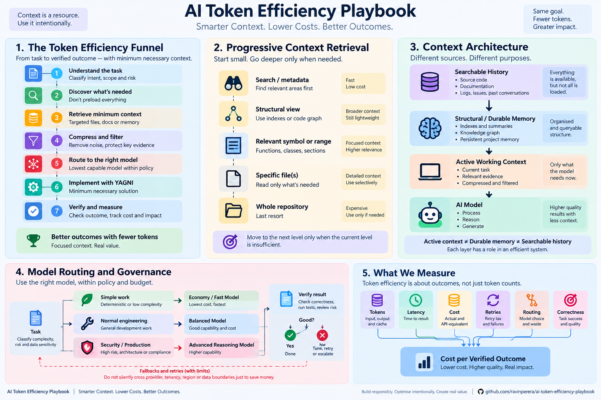

# Visual overview: AI Token Efficiency Playbook

This is the accessible text companion to the overview illustration. Select the image for the full-size version. The illustration is a conceptual map of the playbook, not a deployed service, automatic enforcement layer, or measured performance result. The linked guidance remains canonical.

## 1. The token-efficiency workflow

Understand the task and its risk; discover only relevant resources; retrieve the minimum sufficient context; filter redundant output while preserving important evidence; select an approved, capable model; implement only what is needed; then verify and measure the outcome.

These are complementary practices, not mandatory processing stages. Skip a transformation when it would add overhead without helping the task. YAGNI means "you aren't going to need it": avoid speculative features, not required security, validation, error handling, or accessibility.

Read the [operational checklist](../checklists/token-efficiency-checklist.md) and [minimum-necessary implementation guidance](../guidelines/minimum-necessary-implementation.md).

## 2. Progressive context retrieval

Begin with search or metadata. Use a structural outline or code index when it helps identify the relevant symbol or range. Load full files only when narrower evidence is insufficient. A whole-repository read is not a default final step: narrow the task or improve retrieval first, and always respect approved scope and exclusions.

The illustration's cost labels are qualitative. Index construction, stale-index recovery, retrieval calls, and model caching can change the actual cost. Structural memory helps locate evidence; it does not replace verification against the current source.

Read [progressive context retrieval](../guidelines/progressive-context-retrieval.md).

## 3. Context architecture

Searchable history and authoritative source artefacts, durable memory, and active working context have different purposes. Retain full evidence where authorised; keep durable summaries or indexes separately; load only the facts needed for the current task into active context.

The illustrated connections are not a requirement to copy every source through a memory layer. Retrieve directly from source when necessary. Check authorisation, source revision, freshness, retention, and project boundaries before using stored context. Less context is useful only when necessary evidence remains available.

Read [context hygiene](../guidelines/context-hygiene.md).

## 4. Model routing and governance

Choose the lowest approved model tier that can meet the task's acceptance criteria, then verify the result. Economy, balanced, and advanced tiers are capability categories, not promises about a particular provider's price, speed, or safety. Some deterministic work needs no model at all.

High-risk work needs appropriate validation and accountable human approval; an advanced model is not an approval control. Keep retries bounded, and never silently change provider, tenancy, region, retention, or data boundaries merely to save money.

Read [model routing](../guidelines/model-routing.md) and use the [routing decision template](../templates/model-routing-decision.md).

## 5. What to measure

Measure input, output, and cache tokens alongside latency, actual billed cost, separately labelled API-equivalent estimates, retries, routing decisions, and correctness. Compare the same task and acceptance criteria rather than rewarding less complete work.

For a comparable evaluation set, cost per verified outcome is total cost across all attempts, including failures and rework, divided by the number of verified successful outcomes. When there are no verified successes, report that fact instead of a cost ratio. Report success rate and limitations alongside cost. The illustration's references to lower cost or better outcomes describe goals, not demonstrated results.

Use the [measurement template](../templates/token-savings-measurement.md) and the [evaluation corpus](../benchmarks/evaluation-corpus.md).

## Illustration provenance

This AI-generated, icon-led illustration was created for the playbook and approved by Ravin Perera in the associated conversation. It is stored unchanged as a PNG; no editable vector source is included. Keep the text companion and canonical guidance in sync when revising the visual. An illustration is not independent evidence of a performance or safety claim.

[Return to the README](../README.md).
